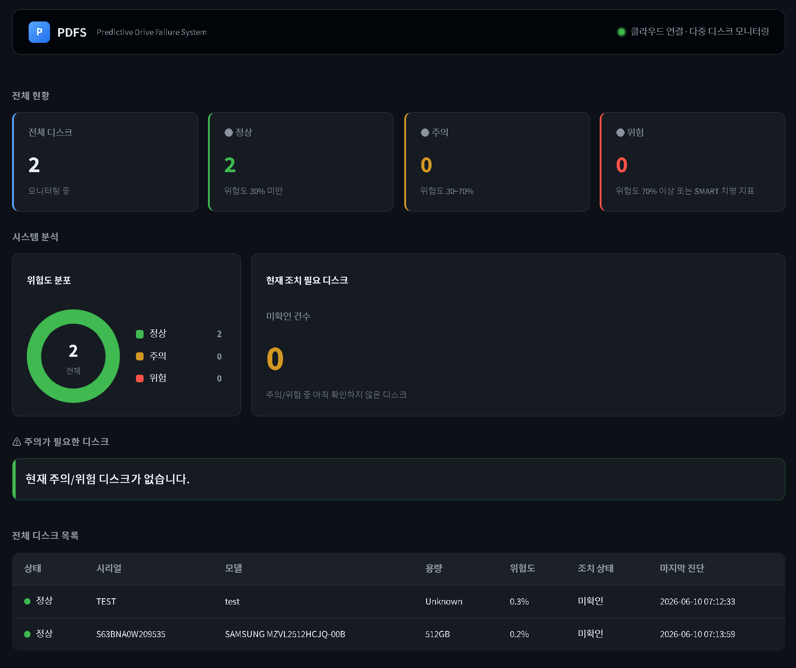
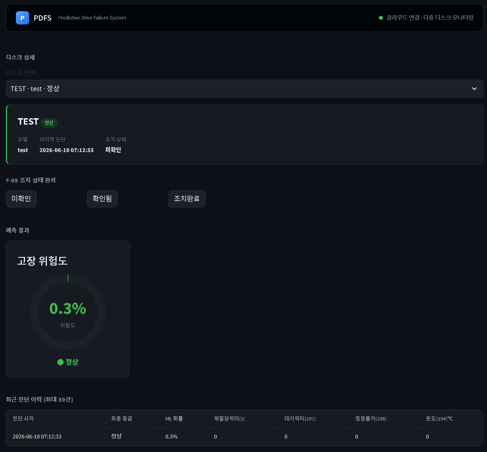
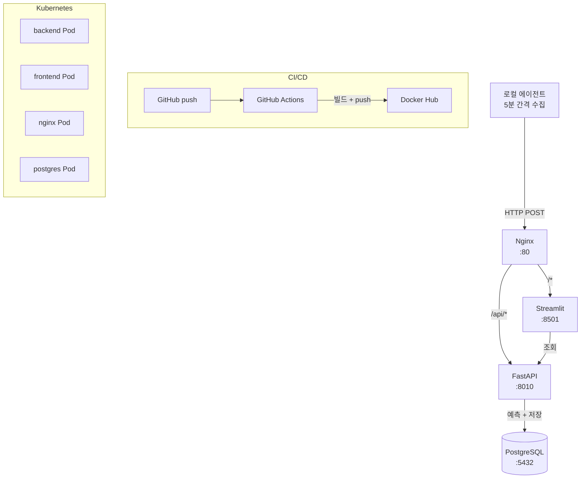

<<<<<<< HEAD
# PDFS — Predictive Drive Failure System

> HDD/SSD SMART 데이터를 수집·분석해 고장을 사전에 예측하는 시스템.  
> 온프레미스 EXE 도구(v1)에서 클라우드 인프라(v2)로 전환한 포트폴리오 프로젝트입니다.

---

## 대시보드 미리보기

**메인 대시보드** — 전체 디스크 현황 및 위험도 분포



**디스크 상세** — 진단 이력 및 조치 상태 관리



---

## v1 → v2 아키텍처 진화

### v1 — 온프레미스 EXE


- 단일 PC에서만 동작
- 데이터가 CSV 파일로만 저장
- 배포 방식: EXE 파일 직접 실행

### v2 — 클라우드 인프라



- 에이전트가 주기적으로 서버에 데이터 전송
- 서버 기반 DB 저장 및 실시간 대시보드
- Docker Compose + Kubernetes 운영
- GitHub Actions CI/CD 자동화

---

## 기술 스택

| 영역 | v1 | v2 |
|------|----|----|
| 데이터 수집 | smartctl (EXE 내장) | 로컬 에이전트 (Python) |
| ML 예측 | RandomForest (로컬) | RandomForest (FastAPI 서버) |
| 저장 | CSV 파일 | PostgreSQL |
| 프론트엔드 | Streamlit (로컬) | Streamlit (Docker 컨테이너) |
| 백엔드 | 없음 | FastAPI |
| 인프라 | 없음 | Docker Compose + Kubernetes |
| CI/CD | 없음 | GitHub Actions + Docker Hub (melooong/pdfs-*) |
| 배포 | EXE 파일 | 컨테이너 이미지 |
| 테스트 | 없음 | pytest 21개 (predictor + API 응답 검증) |

---

## 실행 방법 (Kubernetes)

```bash
cd HPDFS/v2

# 네임스페이스 + 전체 리소스 한 번에 배포
kubectl apply -f k8s/

# Pod 상태 확인
kubectl get pods -n pdfs

# 포트 포워딩 (로컬에서 접속 시)
kubectl port-forward svc/nginx-service 8080:80 -n pdfs
# http://localhost:8080
```

> **k8s 주요 설정:** 4개 Pod 전부 liveness/readiness probe 설정 (httpGet / tcpSocket / exec pg_isready).  
> resource limits으로 Pod가 서버 전체 메모리를 점유하는 상황 방지.

---

## 실행 방법 (Docker Compose)

```bash
# 1. 저장소 클론
git clone https://github.com/hhho0coco1-star/HPDFS.git
cd HPDFS/v2

# 2. 컨테이너 빌드 및 실행
docker compose up -d --build

# 3. 브라우저 접속
# http://localhost
```

### 로컬 에이전트 실행 (Windows)

```bash
cd v2/agent
# 에이전트 시작
start_agent.bat

# 에이전트 중지
stop_agent.bat
```

---

## 폴더 구조

```
HPDFS/
├── v1/                  # 온프레미스 EXE 포터블 버전
└── v2/                  # 클라우드 인프라 버전
    ├── agent/           # 로컬 SMART 수집 에이전트
    ├── backend/         # FastAPI 백엔드 + ML 예측
    │   ├── models/      # 학습된 ML 모델 (.pkl)
    │   └── tests/       # pytest 단위 테스트 (21개)
    ├── frontend/        # Streamlit 대시보드
    ├── nginx/           # Nginx 리버스 프록시
    ├── k8s/             # Kubernetes 매니페스트
    ├── docs/            # 설계 문서 및 프레젠테이션
    └── docker-compose.yml
```

---

## ML 모델

- **알고리즘**: RandomForestClassifier
- **입력**: SMART 지표 8개 (재할당섹터, 대기섹터, 정정불가섹터, 온도 등)
- **출력**: 고장 확률(%) + 등급 (정상 / 주의 / 위험)
- **데이터**: Backblaze HDD 고장 통계 데이터셋

---

## 테스트

```bash
cd v2/backend
pytest tests/ -v
# 21 passed
```

| 파일 | 테스트 수 | 내용 |
|------|----------|------|
| `tests/test_predictor.py` | 16개 | prob_to_level, rule_level, combine_level 경계값 검증 |
| `tests/test_router_diagnose.py` | 5개 | API 응답 형식, MANUAL 저장 방지, 503 방어 |
=======
# HPDFS_castle
pdfs
>>>>>>> 46b75640e9dbf8caa3c5ee9b07ee9913942d1243
